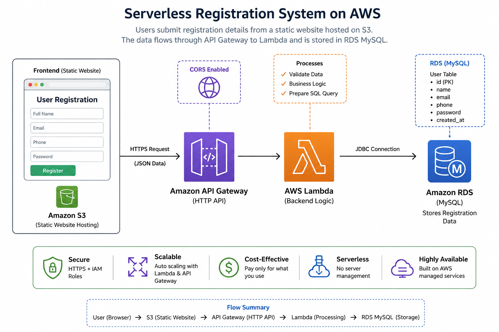

# Serverless Registration Application on AWS

A serverless user registration application built using AWS services.

The application hosts the frontend as a static website on Amazon S3. When a user submits the registration form, the frontend sends the registration data to Amazon API Gateway. API Gateway invokes an AWS Lambda function, which processes the request and stores the user data in an Amazon RDS MySQL database.

## Architecture



## Architecture Flow

```text
User Browser
     |
     v
Amazon S3
Static Website
     |
     | HTTPS POST
     v
Amazon API Gateway
HTTP API
     |
     v
AWS Lambda
regUser
     |
     | PyMySQL
     v
Amazon RDS
MySQL
     |
     v
regdb.users
```

## AWS Services Used

| AWS Service        | Purpose                                                |
| ------------------ | ------------------------------------------------------ |
| Amazon S3          | Hosts the static frontend website                      |
| Amazon API Gateway | Provides the HTTP API endpoint                         |
| AWS Lambda         | Processes registration requests                        |
| Amazon RDS MySQL   | Stores registration data                               |
| AWS IAM            | Provides Lambda execution permissions                  |
| CORS               | Allows the S3 frontend to communicate with API Gateway |

## Application Features

* Static website hosting using Amazon S3
* User registration form
* HTTP API using API Gateway
* Serverless backend using AWS Lambda
* MySQL database using Amazon RDS
* CORS configuration
* Environment variables for database configuration
* Registration data persistence
* Browser-to-API communication using JavaScript Fetch API

## Project Structure

```text
aws-serverless-registration/
│
├── architecture/
│   └── serverless-registration-architecture.png
│
├── configs/
│   └── lambda-environment-example.txt
│
├── documentation/
│   ├── rds-mysql.md
│   ├── iam-role.md
│   ├── lambda.md
│   ├── api-gateway.md
│   ├── s3-static-website.md
│   ├── cors.md
│   ├── deployment.md
│   └── troubleshooting.md
│
├── screenshots/
│   ├── rds.png
│   ├── mysql-workbench.png
│   ├── iam-role.png
│   ├── lambda.png
│   ├── lambda-test.png
│   ├── api-gateway.png
│   ├── api-route.png
│   ├── api-cors.png
│   ├── s3-bucket.png
│   ├── s3-website.png
│   ├── registration-form.png
│   └── mysql-data.png
│
├── source/
│   ├── frontend/
│   │   └── index.html
│   │
│   ├── lambda/
│   │   └── lambda_function.py
│   │
│   └── database/
│       └── schema.sql
│
├── .gitignore
└── README.md
```

## Database

The application uses an Amazon RDS MySQL database.

Database name:

```text
regdb
```

Users table:

```sql
CREATE TABLE users (
    id INT AUTO_INCREMENT PRIMARY KEY,
    name VARCHAR(100),
    email VARCHAR(100),
    password VARCHAR(100)
);
```

To verify registered users:

```sql
USE regdb;

SELECT * FROM users;
```

## Lambda Configuration

The Lambda function uses environment variables for database connection details.

```text
DB_HOST=your-rds-endpoint
DB_USER=admin
DB_PASSWORD=your-password
DB_NAME=regdb
```

Actual database credentials are not stored in this repository.

## API Gateway

API Gateway configuration:

```text
API Type: HTTP API
API Name: regapi
Stage: regstage
Method: POST
Route: /register
Integration: AWS Lambda
Lambda Function: regUser
```

The frontend sends registration data to:

```text
POST /regstage/register
```

## CORS Configuration

CORS is configured in API Gateway to allow the S3-hosted frontend to communicate with the HTTP API.

```text
Access-Control-Allow-Origin: *
Access-Control-Allow-Headers: content-type
Access-Control-Allow-Methods: POST, OPTIONS
```

## Registration Flow

1. User opens the static website hosted on Amazon S3.
2. User enters name, email, and password.
3. JavaScript collects the form data.
4. The frontend sends a POST request to API Gateway.
5. API Gateway invokes the `regUser` Lambda function.
6. Lambda reads the request body.
7. Lambda connects to Amazon RDS MySQL.
8. Registration data is inserted into the `users` table.
9. Lambda returns a success response.
10. The frontend displays the registration result.

## Testing

### Lambda Test

Lambda can be tested using an HTTP API version 2.0 test event.

Example:

```json
{
  "version": "2.0",
  "routeKey": "POST /register",
  "rawPath": "/register",
  "rawQueryString": "",
  "headers": {
    "content-type": "application/json"
  },
  "requestContext": {
    "http": {
      "method": "POST",
      "path": "/register"
    }
  },
  "body": "{\"name\":\"Test User\",\"email\":\"test@example.com\",\"password\":\"123456\"}",
  "isBase64Encoded": false
}
```

Expected result:

```json
{
  "message": "User registered successfully"
}
```

### Database Verification

After a successful registration:

```sql
USE regdb;

SELECT * FROM users;
```

## Troubleshooting

Common issues encountered during deployment:

### 1. Lambda Dependency Error

```text
No module named 'mysql.connector'
```

The Lambda dependency package was not available in the deployment environment.

The project uses the Python MySQL client library required by the Lambda implementation.

### 2. S3 to API Gateway Network Error

```text
TypeError: Failed to fetch
```

Check:

* API Gateway URL
* `POST /register` route
* CORS configuration
* `content-type` allowed header
* `POST` and `OPTIONS` methods
* Browser Network tab

### 3. Database Verification

If Lambda succeeds but data is not visible, verify the RDS connection and run:

```sql
USE regdb;

SELECT * FROM users;
```

## Security Considerations

This project is designed as a learning and demonstration project.

For production environments:

* Use a private RDS instance.
* Use least-privilege IAM permissions.
* Do not use administrator-level permissions for Lambda.
* Store secrets using AWS Secrets Manager or AWS Systems Manager Parameter Store.
* Do not store passwords or AWS credentials in GitHub.
* Use HTTPS for production frontend hosting.
* Use proper authentication and authorization.
* Restrict security group access.

## Future Improvements

Possible improvements include:

* Password hashing using a secure password-hashing algorithm
* User authentication and login
* AWS Secrets Manager integration
* Private RDS deployment inside a VPC
* CloudFront for frontend delivery
* Custom domain with HTTPS
* Amazon Cognito authentication
* CloudWatch monitoring and logging
* CI/CD using GitHub Actions

## Technologies Used

### Frontend

* HTML
* CSS
* JavaScript

### Backend

* Python
* AWS Lambda
* PyMySQL

### Database

* MySQL
* Amazon RDS

### Cloud

* Amazon S3
* Amazon API Gateway
* AWS Lambda
* Amazon RDS
* AWS IAM

## Author

**Vikas Jagtap**

GitHub: `https://github.com/vikasjagtap9696`
